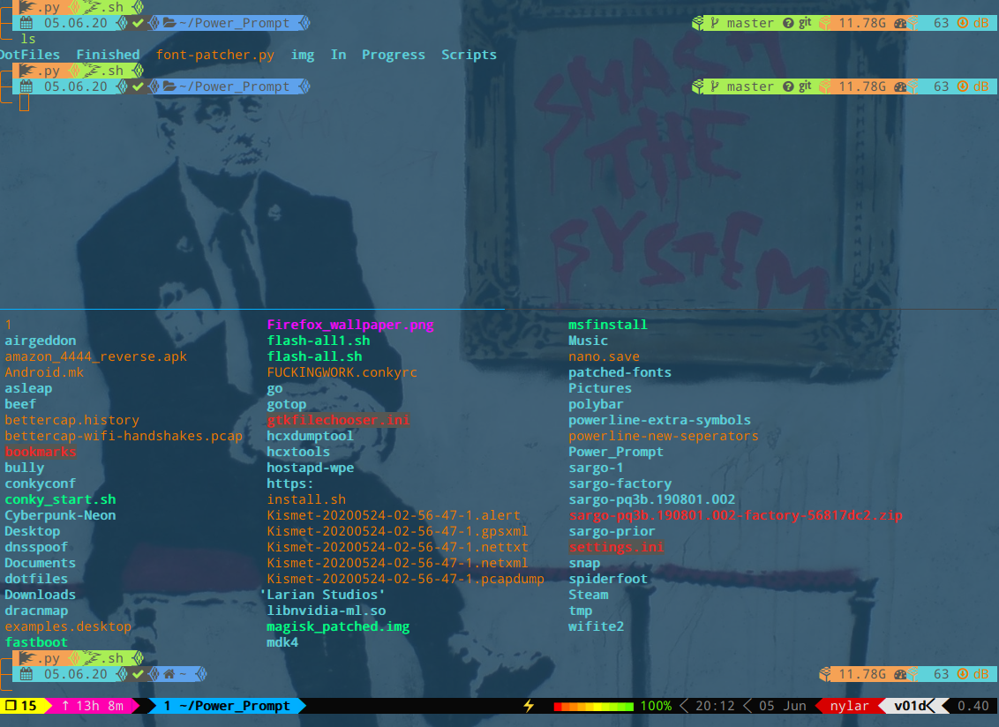
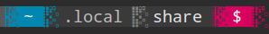

This is currently my Powerlevel9k Prompt.  To give you some idea of the options and things you can do with it.

        
	
	},
        # angly 1
        'patched': {
                'lock': u'\uE0A2',
                'network': u'\uE0A2',
                'separator': u'\uE0B8',
                'separator_thin': u'\uE0B9'

        

	},
        # angly 2
        'patched': {
        	'lock': u'\uE0A2',
        	'network': u'\uE0A2',
        	'separator': u'\uE0BC',
        	'separator_thin': u'\uE0BD'

        
	
	},
        # curvy
        'patched': {
        	'lock': u'\uE0A2',
        	'network': u'\uE0A2',
        	'separator': u'\uE0B4',
        	'separator_thin': u'\uE0B5'
        },

	
	},
	# flames (flamey)
	'patched': {
		'lock': u'\uE0A2',
		'network': u'\uE0A2',
		'separator': u'\uE0C0', 
		'separator_thin': u'\uE0C1'

        },
        # lego (blocky)
        'patched': {
        	'lock': u'\uE0A2',
        	'network': u'\uE0A2',
        	'separator': u'\uE0CE',
        	'separator_thin': u'\uE0CF'
        

	
	},
        # pixelated blocks 2 (large) random fade (pixey)
        'patched': {
        	'lock': u'\uE0A2',
        	'network': u'\uE0A2',
        	'separator': u'\uE0C6',
        	'separator_thin': u'\uE0C6'
        }

